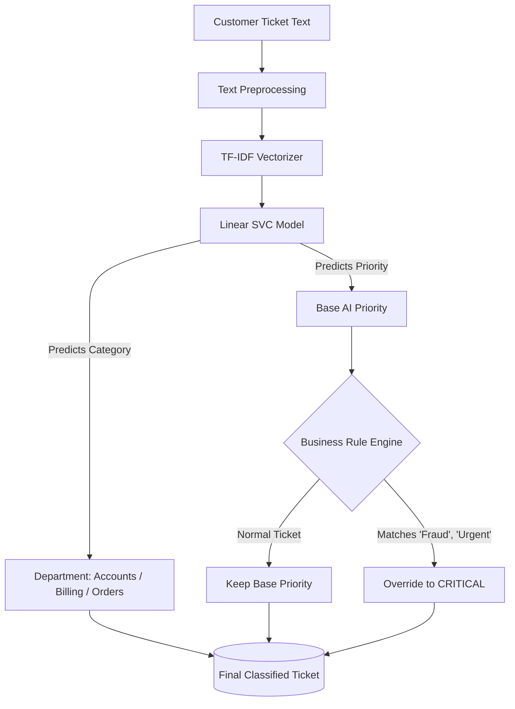
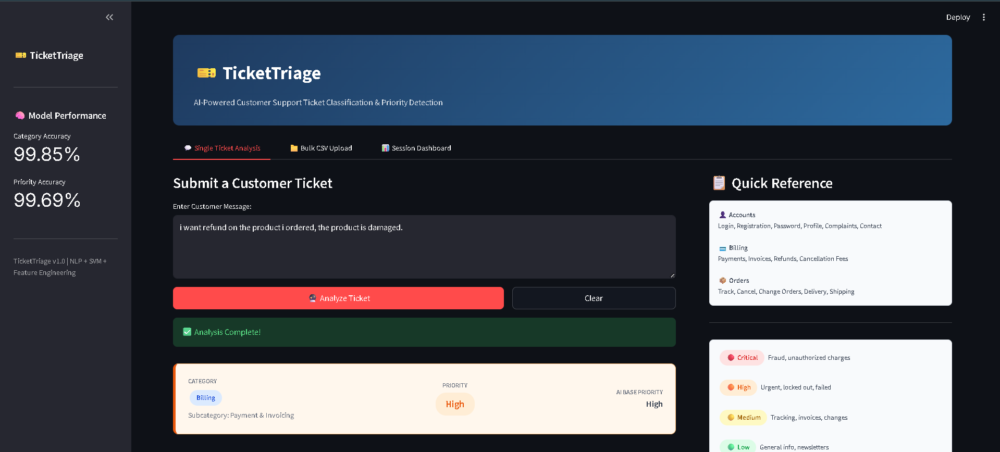

# 🎫 TicketTriage: AI-Powered Customer Support Routing


**TicketTriage** is an intelligent customer support routing system designed to automate the classification and prioritization of inbound tickets. By replacing manual triage with a hybrid architecture, the system instantly analyzes customer messages, categorizes them by department (Accounts, Billing, Orders), and assigns a priority level (Low to Critical).

---

### Hybrid Architecture Workflow


---

<div align="center">
  <h3>Application Dashboard</h3>
  
  <br><br>
</div> 

---

## 🚀 Key Features

* **Hybrid Decision Engine:** Combines the predictive power of a Machine Learning model with the absolute safety of a hardcoded Python business rule engine.
* **Mutually Exclusive Routing:** Ensures that "Critical" emergencies are isolated to a dedicated SWAT queue and completely removed from standard departmental workflows to prevent double-working.
* **Real-Time Analysis UI:** A clean, interactive Streamlit dashboard for individual ticket testing and triage.
* **Bulk Processing Engine:** Upload a raw CSV of customer messages and download a consolidated, routed ZIP file of department-specific queues in seconds.

---

## 🧠 System Architecture

TicketTriage operates on a dual-layer validation system:

1. **Layer 1 (The ML Brain):** A `TfidfVectorizer` converts natural language into numerical features, which are then evaluated by a **Linear Support Vector Classifier (SVC)** to predict the base category and priority.
2. **Layer 2 (The Safety Net):** Because ML models can misclassify rare or Out-of-Distribution (OOD) data, a hardcoded **Business Rule Engine** scans the text for severe keywords (e.g., "fraud", "stolen"). If triggered, it forcefully overrides the AI's prediction, escalates the ticket to "Critical", and logs a business rule flag.

---

## 📂 Project Structure

```text
TicketTriage/
│
├── data/                   # Raw and processed datasets (ignored in git)
├── models/                 # Serialized model (.pkl) files (ignored in git)
├── src/                    # Core pipeline logic
│   ├── preprocessing.py    # Text cleaning and vectorization
│   ├── train_model.py      # ML training script
│   └── predict_bulk.py     # Batch processing and business rule engine
│
├── app.py                  # Streamlit frontend and UI logic
├── requirements.txt        # Python dependencies
└── README.md               # Project documentation
